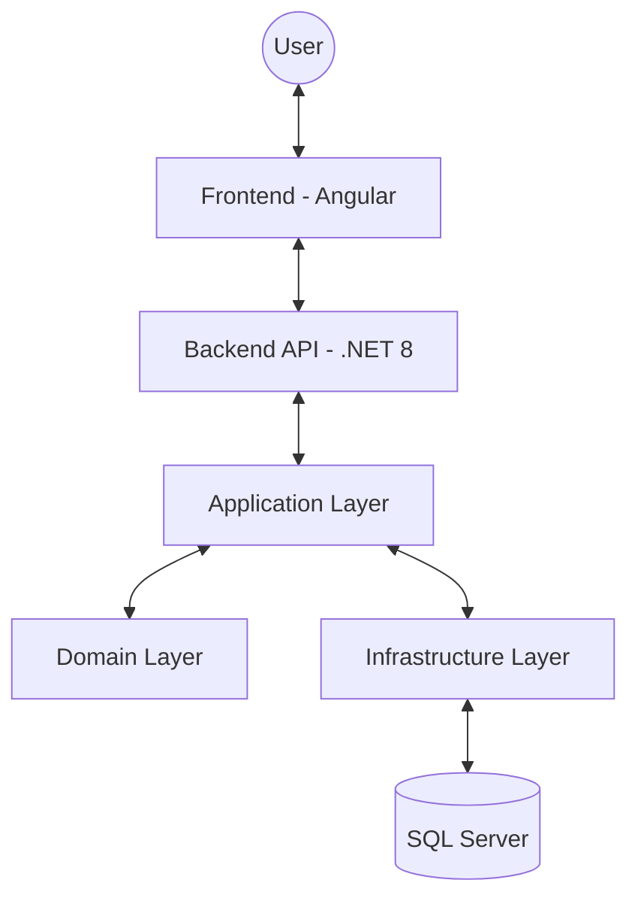

# 📋 Job Tracking System

[](https://github.com/yourname/JobTrackingSystem)
[](LICENSE)
[](https://dotnet.microsoft.com/download/dotnet/8.0)
[](https://angular.io/)
[](docker-compose.yml)

A powerful, comprehensive job application tracking system designed to streamline your job search. Features automated message generation, OCR processing, and seamless multi-channel support (WhatsApp, Email).

---

## 🏗️ Architecture Overview

The system is built on **Clean Architecture** principles, ensuring a robust, maintainable, and scalable codebase.



---

## 🛠️ Tech Stack

| Component | Technology |
| :--- | :--- |
| **Backend** | .NET 8, ASP.NET Core Web API, EF Core |
| **Frontend** | Angular 17, Tailwind CSS, RxJS |
| **Database** | Microsoft SQL Server |
| **DevOps** | Docker, Docker Compose |
| **Features** | OCR Processing, SMTP Integration, WhatsApp Links |

---

## 🚀 Quick Start

Get up and running in less than 5 minutes.

### 1. Prerequisites
- **SDKs**: .NET 8 · Node.js 18+
- **Database**: SQL Server (LocalDB or Express)

### 2. Run with Docker (Easiest)
```bash
docker-compose up -d
```

### 3. Manual Startup
```bash
# Start Backend
cd Backend/src/JobTrackingSystem.API
dotnet run

# Start Frontend (In new terminal)
cd Frontend
npm start
```

🔗 **Access**: [http://localhost:4200](http://localhost:4200)  
📖 **API Docs**: [https://localhost:5001/swagger](https://localhost:5001/swagger)

---

## ✨ Key Features

- 📝 **Smart Classification**: Automatically categorizes jobs into Backend, Frontend, or Fullstack.
- 📸 **OCR Integration**: Extracts job details directly from images and screenshots.
- 🤖 **AI-Ready Messaging**: Generates personalized application messages using custom templates.
- 💬 **One-Click Contact**: Direct integration with WhatsApp (wa.me) and Email (SMTP).
- 🎨 **Modern Dashboard**: A responsive, high-performance UI built with Tailwind CSS.

---

## 📁 Project Explorer

| Path | Purpose |
| :--- | :--- |
| [`Backend/`](Backend/) | Core logic, API, and Database migrations. |
| [`Frontend/`](Frontend/) | Modern Angular dashboard and UI components. |
| [`docs/`](docs/INDEX.md) | Comprehensive guides and technical references. |

---

## 📚 Documentation Portal

Explore our detailed documentation for deep dives:

| Section | Description |
| :--- | :--- |
| 🏁 [Quick Start](docs/QUICKSTART.md) | 5-minute setup and test drive. |
| ⚙️ [Installation](docs/SETUP.md) | Comprehensive setup and troubleshooting. |
| 📐 [Architecture](docs/ARCHITECTURE.md) | Design patterns and system flow. |
| 🔌 [API Reference](docs/API_REFERENCE.md) | Full endpoint documentation. |
| 🚢 [Deployment](docs/DEPLOYMENT.md) | Docker and Cloud hosting guide. |

---

## 🤝 Contributing & Security

- **Contributing**: Please see our [Contributing Guide](.github/CONTRIBUTING.md).
- **Security**: Report vulnerabilities via [SECURITY.md](SECURITY.md).
- **Updates**: Track changes in the [CHANGELOG.md](CHANGELOG.md).

---

## 📄 License

Distributed under the **MIT License**. See [`LICENSE`](LICENSE) for more information.

---

<p align="center">
  Built with ❤️ for Job Seekers
</p>
