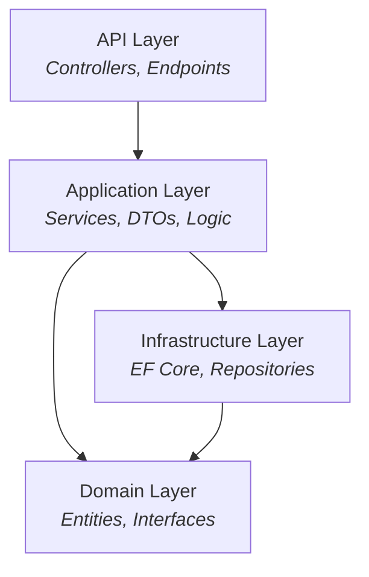
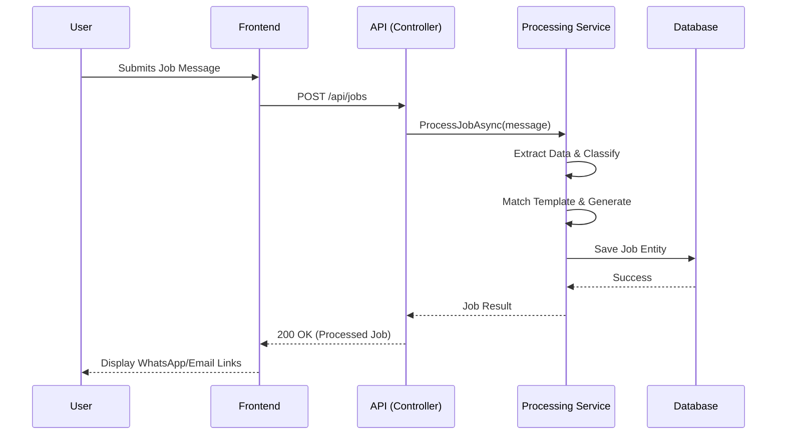

# 📐 System Architecture

The Job Tracking System is built using **Clean Architecture** (Onion Architecture) principles. This ensures that the core business logic is isolated from external concerns like databases, UI frameworks, and third-party APIs.

---

## 🏗️ Core Architecture

The system is divided into four distinct layers, each with a specific responsibility and strict dependency rules.



---

## 🧱 Layer Breakdown

| Layer | Responsibility | Key Components |
| :--- | :--- | :--- |
| **API** | Entry point for HTTP requests. Handles routing, validation, and responses. | `JobsController`, `TemplatesController`, `Program.cs` |
| **Application** | Orchestrates business processes and transformations. | `JobProcessingService`, `JobClassificationService`, `MessageGenerationService` |
| **Infrastructure**| Implementation of data access and external integrations. | `JobTrackingDbContext`, `Repositories`, `Migrations` |
| **Domain** | Core business entities and repository contracts. Pure logic, no dependencies. | `Job`, `Template`, `IJobRepository` |

## Layer Responsibilities

### API Layer
- **Purpose**: HTTP request/response handling
- **Components**:
  - `JobsControllerV2`: Job CRUD and processing endpoints
  - `TemplatesController`: Template management endpoints
- **Responsibilities**:
  - Route requests to appropriate services
  - Validate input parameters
  - Return formatted responses
  - Handle HTTP status codes

### Application Layer
- **Purpose**: Business logic and orchestration
- **Key Services**:
  - `JobProcessingService`: Orchestrates job processing pipeline
  - `JobClassificationService`: Categorizes jobs
  - `JobExtractionService`: Extracts data from messages
  - `MessageGenerationService`: Creates personalized messages
  - `TemplateService`: Template management logic
- **Responsibilities**:
  - Implement business rules
  - Coordinate between domain and infrastructure
  - Transform DTOs
  - Handle cross-cutting concerns

### Domain Layer
- **Purpose**: Core business entities and contracts
- **Components**:
  - `Job`: Job entity with properties
  - `Template`: Template entity with properties
  - `IJobRepository`: Job data access contract
  - `ITemplateRepository`: Template data access contract
- **Responsibilities**:
  - Define entities
  - Define repository interfaces
  - Encapsulate business logic in entities

### Infrastructure Layer
- **Purpose**: Data persistence and external services
- **Components**:
  - `JobTrackingDbContext`: EF Core context
  - `JobRepository`: Job data access implementation
  - `TemplateRepository`: Template data access implementation
  - `Migrations`: Database schema changes
- **Responsibilities**:
  - Implement repository interfaces
  - Handle database operations
  - Manage migrations
  - Configure EF Core

## 🔄 Data Flow

### Job Processing Pipeline



### Template Matching Logic

```mermaid
graph TD
    Start[Job Classified] --> Query{Find Template<br/>for Category?}
    Query -- Found --> Apply[Apply Custom Template]
    Query -- Not Found --> Default[Apply Default Template]
    Apply --> Replace[Replace {Placeholders}]
    Default --> Replace
    Replace --> Final[Generate Final Message]
```

## Key Design Patterns

### Repository Pattern
- Abstracts data access logic
- Enables easy testing with mocks
- Allows switching data sources

### Dependency Injection
- Loose coupling between layers
- Easy to test with mock dependencies
- Configured in `Program.cs`

### Service Layer Pattern
- Encapsulates business logic
- Reusable across controllers
- Single responsibility principle

### DTO Pattern
- Separates API contracts from domain entities
- Prevents exposing internal structure
- Enables API versioning

## Scalability Considerations

### Current Architecture
- Single API instance
- Single database
- Suitable for small to medium workloads

### Future Enhancements
- **Horizontal Scaling**: Load balancer + multiple API instances
- **Caching**: Redis for template caching
- **Message Queue**: Background job processing with Hangfire
- **Microservices**: Separate services for classification, extraction, generation
- **Database Replication**: Read replicas for reporting

## Security Architecture

### Authentication & Authorization
- Currently: No authentication (can be added)
- Future: JWT tokens, role-based access control

### Data Protection
- Connection strings in configuration
- SQL parameterized queries (EF Core)
- Input validation on all endpoints

### API Security
- CORS configuration
- HTTPS enforcement
- Rate limiting (can be added)

## Error Handling Strategy

### Layers
1. **API Layer**: Catches exceptions, returns HTTP error codes
2. **Application Layer**: Business logic validation
3. **Infrastructure Layer**: Database error handling

### Logging
- Structured logging at all layers
- Error details for debugging
- Audit trail for important operations

## Testing Strategy

### Unit Tests
- Test services in isolation
- Mock repositories
- Test business logic

### Integration Tests
- Test API endpoints
- Use test database
- Verify data persistence

### E2E Tests
- Test complete workflows
- Frontend + Backend
- Real database

## Deployment Architecture

### Development
- Local SQL Server (LocalDB)
- Local API (localhost:5001)
- Local Frontend (localhost:4200)

### Production
- Cloud SQL Server (Azure SQL, AWS RDS)
- Cloud API (Azure App Service, AWS Lambda)
- CDN for Frontend (Azure Static Web Apps, CloudFront)
- Load balancer for API
- Monitoring and logging

## Performance Optimization

### Backend
- Database indexing on frequently queried columns
- Query optimization with EF Core
- Caching for templates
- Async/await for I/O operations

### Frontend
- Lazy loading of components
- OnPush change detection
- Tree-shaking for bundle size
- Compression and minification

## Monitoring & Observability

### Metrics
- API response times
- Database query performance
- Error rates
- User activity

### Logging
- Structured logging (Serilog)
- Log aggregation (Application Insights)
- Error tracking (Sentry)

### Alerting
- High error rates
- Slow API responses
- Database connection issues
- Disk space warnings
