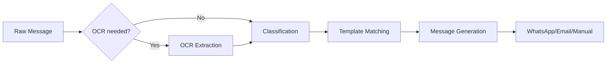

# 📚 Documentation Hub

Welcome to the **Job Tracking System** documentation. Here you'll find everything from architectural deep-dives to quick setup guides.

---

## 🚀 Getting Started

If you're new here, follow these steps to get the system running:

1.  **[Quick Start](QUICKSTART.md)**: The "happy path" to getting the app running in 5 minutes.
2.  **[Installation & Setup](SETUP.md)**: Detailed guide for manual installation, database configuration, and troubleshooting.
3.  **[API Reference](API_REFERENCE.md)**: Explore the RESTful endpoints and data schemas.

---

## 🏗️ System Architecture

Understand how the system is built and how data flows through the layers.

*   **[Core Architecture](ARCHITECTURE.md)**: Clean Architecture layers, design patterns, and dependency injection.
*   **[Backend Structure](BACKEND_STRUCTURE.md)**: Deep dive into the `.NET` project organization.
*   **[Frontend Structure](FRONTEND_STRUCTURE.md)**: Overview of the Angular application architecture.

---

## 🛠️ Specialized Guides

Detailed documentation for specific features and workflows.

*   **[WhatsApp Integration](WHATSAPP.md)**: Configuring webhooks and Business API settings.
*   **[Deployment Guide](DEPLOYMENT.md)**: Instructions for Docker, Azure, and AWS environments.
*   **[Feature List](FEATURES.md)**: Comprehensive breakdown of all system capabilities.

---

## 🔄 Core Workflows

### Job Processing Pipeline

---

## 🛠️ Common Developer Tasks

| Task | Guide / File |
| :--- | :--- |
| **Add a new job category** | Update `JobClassificationService.cs` and add a Template via UI. |
| **Change API Port** | `Backend/src/JobTrackingSystem.API/Properties/launchSettings.json` |
| **Update DB Schema** | Run `dotnet ef migrations add <Name>` and `dotnet ef database update`. |
| **Configure SMTP** | Update the `.env` file or `appsettings.json`. |

---

## 🆘 Support & Troubleshooting

*   Check the **Troubleshooting** section in [SETUP.md](SETUP.md#troubleshooting).
*   Review the [CHANGELOG.md](../CHANGELOG.md) for recent updates and breaking changes.
*   Report security issues via [SECURITY.md](../SECURITY.md).

---

  <a href="../README.md">← Back to Project Root</a>

